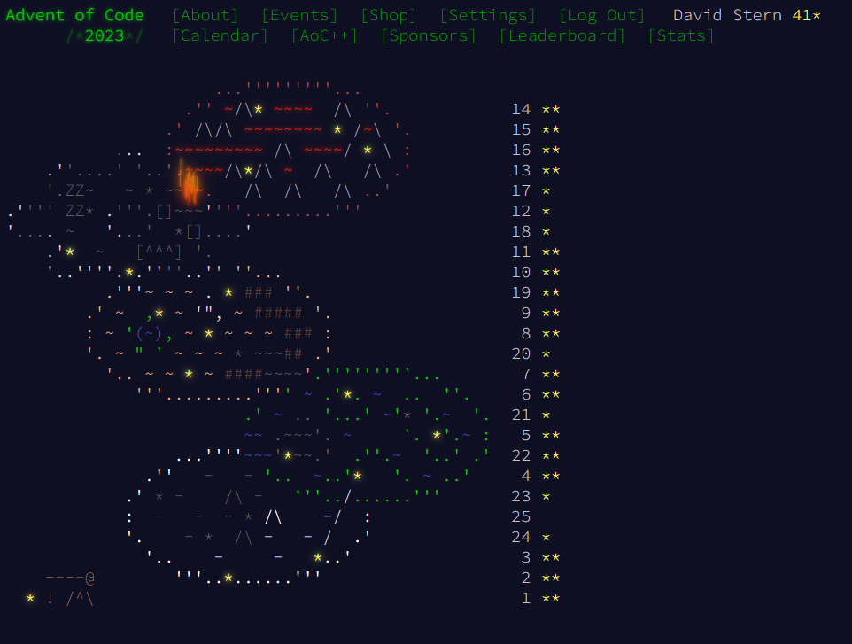

### General Description

I am working through the Advent of Code challenges for 2023, as can be found [here](https://adventofcode.com/2023). All solutions are either in Python or Rust. I currently have 27 stars. Each day's challenge has two parts. Each day's solution can be found in that day's particular file (for example, day 15 would be found in `day15.rs`).



#### Rust Solutions

For a day whose solutions is written in Rust, running `cargo run` will typically print the solution, provided the input file exists for Rust solutions, and that day's `SolveAdvent` methods are being invoked in `main.rs`.

Each days solution must implement the trait:

```
trait SolveAdvent {
    ///How to solve part1 of the days puzzle.
    fn solve_part1(path_to_file: &str);
    ///How to solve part2 of the days puzzle.
    fn solve_part2(path_to_file: &str);
}
```

where the two methods each take the file path to the input.

#### Python Solutions

Similar to the Rust solutions, the Python solutions are in the `./advent_python` folder. Because of the `__main__.py` file,
the module can be directly invoked using the command `python -m advent_python`. All Python solutions inherit from an abstract base class in the `base.py` file, and must inherit from the following class:

```

class SolveAdvent(ABC):
    def __init__(self, file_path: str):
        with open(file_path, "r") as file:
            file_content = file.readlines()
        self.file_content = file_content

    @abstractmethod
    def solve_part1(self):
        """
        Solve Part1 of the Days Advent Problem
        """
        pass

    @abstractmethod
    def solve_part2(self):
        """
        Solve Part2 of the Days Advent Problem.
        """
        pass
```
